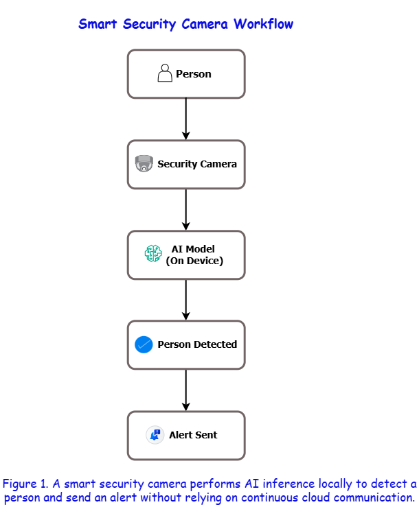
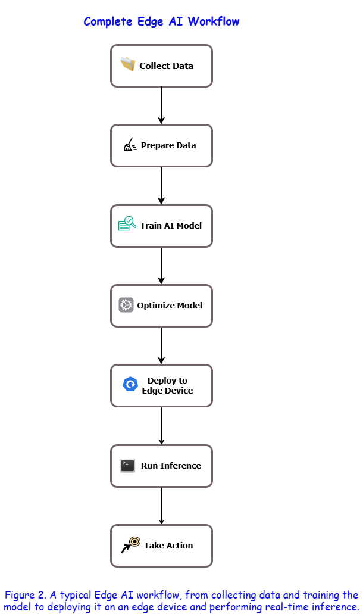

# Getting Started with Edge AI: A Beginner's Guide

>**Estimated Reading Time:** 12–15 minutes

Learn the fundamentals of Edge AI, understand how AI models are trained and deployed to edge devices, and explore real-world applications through practical examples.

---

**Audience:** Developers, students, and AI beginners

**Prerequisites:**
- Basic computer knowledge
- Familiarity with Python is helpful but not required
- No prior experience with Artificial Intelligence (AI) or Machine Learning (ML) is needed
  
## Introduction

Artificial Intelligence (AI) powers many technologies we use every day, from voice assistants and recommendation systems to self-driving cars and smart security cameras. Traditionally, AI applications rely on cloud servers to process data and generate predictions. Devices collect data, send it over the internet to the cloud, and wait for the results before taking action.

While this approach provides access to powerful computing resources, it also introduces challenges such as network latency, internet dependency, bandwidth consumption, and privacy concerns. These limitations become more significant in applications that require real-time responses or operate in locations with limited or unreliable internet connectivity.

Edge AI addresses these challenges by bringing AI computation closer to where the data is generated. Instead of sending data to a remote server, AI models are deployed directly on edge devices such as cameras, smartphones, drones, sensors, and embedded systems. By processing data locally, these devices can make intelligent decisions faster, reduce the amount of data transmitted over the network, and continue operating even when internet access is unavailable.

This guide introduces the core concepts of Edge AI, explains how it differs from traditional cloud-based AI, and walks through the complete Edge AI workflow—from data collection and model training to deployment and inference. Throughout the guide, we'll use a **smart security camera** as a practical example to illustrate how Edge AI works in real-world applications.

## 🧠 What is Edge AI?

Imagine you have installed a smart security camera outside your home.

One evening, someone walks up to your front door. The camera immediately needs to answer a simple but important question:

**"Is this a person, or is it just a tree moving in the wind?"**

There are two ways the camera can find the answer.

- It can send the video over the internet to a cloud server, wait for the server to analyze it, and then receive the result.
- Or, it can analyze the video by itself and make the decision almost instantly.

The second approach is called **Edge AI**.

**Edge AI** is the practice of running Artificial Intelligence (AI) models directly on the devices that generate or collect data, instead of sending that data to a remote cloud server for processing.

These devices are called **edge devices** because they operate at the *edge* of the network—close to where the data is created.

Common edge devices include:

- Smartphones
- Security cameras
- Smart speakers
- Drones
- Industrial sensors
- Wearable devices
- Autonomous vehicles

Since the AI model runs directly on the device, it can analyze data and make decisions locally. This reduces the need to constantly communicate with a cloud server, leading to faster responses, lower bandwidth usage, and improved privacy.

  

> **Note:**
>
> Edge AI does **not** eliminate the cloud. In many real-world applications, edge devices and cloud servers work together. The edge device performs time-sensitive tasks locally, while the cloud is often used for model training, long-term storage, and large-scale data analysis.

## 💭 Why Edge AI?

If cloud computing has been working so well for years, why do we even need Edge AI?

To answer that, let's go back to our smart security camera.

Imagine someone rings your doorbell at midnight. The camera records the video and sends it to a cloud server for analysis. The server identifies the visitor and sends the result back to your camera.

Sounds simple, right?

But this process depends on three things:

- A stable internet connection
- Fast communication with the cloud server
- Enough time for the data to travel back and forth

Even if this takes only a second or two, that delay can be unacceptable in situations where decisions need to be made instantly.

Now imagine the internet goes down.

Should your security camera stop detecting people?

Of course not.

This is where Edge AI becomes valuable. Since the AI model runs directly on the device, it can continue making decisions even without an internet connection.

Edge AI isn't designed to replace cloud computing. Instead, it solves problems where speed, reliability, and privacy matter the most.

Some of the biggest advantages of Edge AI include:

### Faster Response Time

Since data is processed on the device itself, there's no need to send it to a remote server and wait for the response. This significantly reduces latency and enables real-time decision-making.

### Better Privacy

Sensitive data, such as images, videos, or personal information, can remain on the device instead of being transmitted over the internet. This reduces the risk of exposing private information.

### Reduced Bandwidth Usage

Sending every piece of data to the cloud consumes internet bandwidth. Edge AI processes most of the data locally, so only important information needs to be transmitted.

### Improved Reliability

Edge devices can continue functioning even when the internet connection is slow, unstable, or completely unavailable.

### Lower Operational Costs

Processing data locally can reduce the amount of cloud computing and data transfer required, helping organizations lower operational costs over time.

## 🔍 How Edge AI Works

Great! Now that we know **what** Edge AI is and **why** it matters, let's see how it actually works.

At first, the complete workflow may seem a little overwhelming. Don't worry—we'll break it down into simple steps.

Let's continue with our **smart security camera** example.

Imagine you've built a security camera that should recognize whether the object in front of it is a **person**, a **vehicle**, or just an **animal**. How does the camera learn to make these decisions?

The answer lies in a series of steps that every Edge AI application follows.

The following workflow summarizes the complete lifecycle of a typical Edge AI application:

  

Let's explore each step in detail.

### Step 1: Collect Data

Every AI model starts with data.

For our security camera, this means collecting thousands of images and videos containing people, vehicles, animals, and other everyday objects.

The more diverse the data, the better the model can learn to recognize different situations.

>**Tip:**
>
> Think of data as the study material for an exam. A student who studies from a wide variety of questions is usually better prepared than someone who memorizes only a few examples.

### Step 2: Prepare the Data

Real-world data is rarely perfect.

Some images may be blurry, duplicated, incorrectly labeled, or simply irrelevant.

Before training the model, the dataset is cleaned and organized. In many projects, the images are also resized, labeled, or augmented to improve the model's performance.

This step helps ensure that the model learns from high-quality data instead of noisy or misleading examples.

### Step 3: Train the AI Model

Now comes the learning phase.

During training, the AI model studies the prepared dataset and gradually learns to identify patterns.

For example, after seeing thousands of images, the model begins to recognize features that commonly appear in people, vehicles, and animals.

It doesn't memorize every image. Instead, it learns the patterns that make each object unique.

>**Note:**
>
>Training usually requires powerful hardware such as GPUs and is commonly performed on cloud servers or high-performance computers—not on the edge device itself.

### Step 4: Deploy the Model

Once the model has been trained, can we directly copy it to the security camera and expect everything to work?

Not quite.

Remember, our camera isn't as powerful as the computer used for training. It has limited memory, processing power, and battery life. A large AI model may run perfectly on a high-end GPU but struggle on a small edge device.

Before deployment, the model is often **optimized** to make it smaller, faster, and more efficient without significantly affecting its accuracy. This process may include techniques such as quantization, pruning, or model conversion.

Once optimized, the model is deployed to the edge device—in our case, the smart security camera.

You can think of deployment as installing an application on your phone. After installation, the application is ready to use whenever you need it.

>**Note:**
>
> Model training usually happens only once (or occasionally when improvements are needed), but the deployed model may perform thousands or even millions of predictions every day.

### Step 5: Run Inference

Now comes the exciting part.

A visitor walks towards your front door.

The camera captures the image and immediately passes it to the deployed AI model.

Within a fraction of a second, the model analyzes the image and predicts:

> "This is a person"

This prediction is called **inference**.

Simply put, **inference is the process of using a trained AI model to make predictions on new, unseen data.**

Unlike training, inference doesn't teach the model anything new. The model simply uses what it has already learned to make intelligent decisions.

> **🤔 Did You Know?**
>
> Every time you unlock your smartphone using facial recognition or receive a spam warning in your email, an AI model is performing **inference**—often in just a few milliseconds.

At this point, our security camera has everything it needs:

- It captures the image.
- It analyzes the image locally.
- It recognizes the person.
- It sends an alert to the homeowner.

All of this happens within seconds—and often without sending the image to the cloud.

## ☁️ Edge AI vs Cloud AI

By now, you might be wondering:

> "If both Edge AI and Cloud AI can perform intelligent tasks, which one is better?"

The honest answer is:

**Neither is universally better.** It depends on the problem you're trying to solve.

Let's compare them.

The following figure illustrates how data flows in a Cloud AI system compared to an Edge AI system:

  

The diagram gives us a high-level view of both approaches. Let's compare them in more detail.

| Feature | Edge AI | Cloud AI |
|---------|---------|----------|
| **Where data is processed** | On the local device | On remote cloud servers |
| **Internet required** | Not always | Usually yes |
| **Response time** | Very fast | Depends on network speed |
| **Privacy** | Better, since data stays on the device | Data is usually transmitted to the cloud |
| **Computing power** | Limited by device hardware | Very high |
| **Best suited for** | Real-time applications | Large-scale data processing and model training |

Let's revisit our smart security camera one last time.

With **Cloud AI**, every video frame must travel to a remote server before the camera knows what's happening. This works well when a stable internet connection is available, but delays may occur if the network is slow.

With **Edge AI**, the camera analyzes the video on the device itself. As a result, it can recognize people almost instantly—even if the internet connection is unavailable.

That doesn't mean cloud computing becomes unnecessary.

In fact, many modern AI systems combine both approaches. The cloud is often used to train and improve AI models, while edge devices use those trained models to make fast, real-time decisions.

🎯 **Key Takeaway:**

> Edge AI and Cloud AI are not competitors—they are partners. The cloud provides the intelligence, while the edge delivers it where and when it's needed.

## 🌍 Real-World Applications of Edge AI

By now, you've probably realized that Edge AI isn't some futuristic technology—it's already part of our daily lives. 🙂

Let's explore a few places where it's making a real difference.

### 📱 Smartphones

Have you ever unlocked your phone using facial recognition?

Instead of sending your face to a cloud server every time you unlock your device, many modern smartphones perform this recognition locally. This makes the process faster while keeping your biometric data more private.

### 🚗 Autonomous Vehicles

Self-driving cars must continuously detect pedestrians, traffic signs, and other vehicles in real time.

Imagine waiting for a cloud server to decide whether to apply the brakes—that delay could be dangerous.

By processing data on the vehicle itself, Edge AI helps autonomous systems react almost instantly.

### 🏥 Healthcare

Hospitals and wearable health devices use Edge AI to monitor patients and detect abnormalities such as irregular heartbeats.

Processing sensitive medical data locally can improve privacy while enabling quicker responses during emergencies.

### 🏭 Smart Manufacturing

Factories use cameras and sensors to inspect products as they move along production lines.

If a defective product is detected, the system can immediately remove it without waiting for instructions from a remote server.

### 🌾 Smart Agriculture

Modern farms use drones, cameras, and sensors to monitor crop health, detect pests, and estimate soil moisture.

Instead of uploading massive amounts of data, edge devices can analyze conditions directly in the field and provide immediate recommendations.

### 🏠 Smart Homes

Devices such as security cameras, smart doorbells, and voice assistants often use Edge AI to perform everyday tasks quickly and efficiently.

For example, a smart doorbell can recognize familiar faces and notify you before the visitor even presses the bell.

🎯 **Key Takeaway:**

>Edge AI is already powering many technologies we use every day. From smartphones and hospitals to factories and farms, processing data closer to its source enables faster, smarter, and more reliable decision-making.

## ⚠️ Challenges and Limitations

By now, Edge AI probably sounds like the perfect solution.

But like every technology, it comes with its own set of challenges.

Understanding these limitations is just as important as understanding its advantages.

### Limited Computing Resources

Edge devices are usually much smaller and less powerful than cloud servers.

For example, a smart camera cannot match the processing power of a high-end GPU used in a data center. Because of this, developers often need to optimize AI models before deploying them.

### Limited Storage and Memory

Large AI models can require significant storage space and memory.

Many edge devices have limited hardware resources, making it difficult to run extremely large models without reducing their size.

### Battery Consumption

Devices such as smartphones, drones, and wearable gadgets often run on batteries.

Running AI models continuously can increase power consumption and reduce battery life if the models are not optimized.

### Model Updates

AI models continue to improve over time.

Whenever a better model becomes available, it must be deployed to thousands—or sometimes millions—of edge devices. Managing these updates efficiently can become a challenge.

### Hardware Differences

Not all edge devices are the same.

An AI model that works smoothly on one device may perform differently on another because of differences in processors, memory, or operating systems.

> **🤔 Did You Know?**
>
> Some modern AI models are compressed to less than **10 MB** so they can run efficiently on smartphones, smartwatches, and tiny IoT devices without significantly reducing their accuracy.

🎯 **Key Takeaway:**

>Edge AI offers many advantages, but building efficient Edge AI solutions requires balancing speed, accuracy, hardware limitations, and power consumption.

## 🚀 Best Practices for Building Edge AI Applications

Now that we've explored how Edge AI works and where it is used, let's look at a few practices that help developers build efficient and reliable Edge AI applications.

### Choose the Right Hardware

Every Edge AI project begins with selecting suitable hardware.

A simple image classification task may run smoothly on a smartphone, while more demanding applications might require specialized AI accelerators or embedded computing devices.

Choosing hardware that matches the application's requirements helps achieve better performance and efficiency.

### Optimize the AI Model

A highly accurate model is not always the best choice.

Large models often require more memory and processing power, making them unsuitable for resource-constrained devices.

Optimizing the model before deployment can significantly improve speed while maintaining acceptable accuracy.

### Test in Real-World Conditions

A model that performs well in a laboratory environment may behave differently in real-world situations.

Testing the application under different lighting conditions, weather, camera angles, and network environments helps ensure reliable performance after deployment.

### Keep Models Updated

As new data becomes available, AI models should be retrained and updated to improve their accuracy.

Regular updates help Edge AI applications adapt to changing environments and maintain consistent performance.

### Protect User Privacy

Many Edge AI applications process sensitive information such as images, videos, voice recordings, or health data.

Developers should follow privacy best practices by collecting only the necessary data, storing it securely, and complying with applicable regulations.

🎯 **Key Takeaway:**

>Building a successful Edge AI application isn't just about creating an accurate AI model. It also involves choosing the right hardware, optimizing performance, testing thoroughly, and protecting user data.

## ✅ Conclusion

Congratulations! You've just taken your first step into the world of Edge AI : )

At the beginning of this guide, we explored a simple question:

**"Can a device make intelligent decisions without constantly relying on the cloud?"**

Now you know the answer.

Edge AI enables devices to process data locally, make intelligent decisions in real time, and continue operating even in environments where internet connectivity is limited or unavailable.

Along the way, you've learned:

- What Edge AI is
- Why it has become increasingly important
- How an Edge AI system works
- The difference between Edge AI and Cloud AI
- Where Edge AI is used in everyday life
- The challenges developers face
- Best practices for building efficient Edge AI applications

The field of Edge AI is evolving rapidly, with new hardware, tools, and optimization techniques making intelligent devices more powerful every year.

Whether your goal is to build smart cameras, autonomous robots, healthcare devices, or industrial automation systems, understanding the fundamentals of Edge AI provides a strong foundation for exploring more advanced AI technologies.

Keep learning, keep experimenting, and most importantly—stay curious. Every expert was once a beginner. 😉

🎯 **Key Takeaway:**

>Edge AI isn't just about running AI on smaller devices. It's about bringing intelligence closer to where it's needed, enabling faster, smarter, and more reliable decision-making.

## 📖 Glossary of Key Terms

This glossary provides quick definitions of the key terms introduced throughout this guide.

| Term | Definition |
|------|------------|
| **Artificial Intelligence (AI)** | A field of computer science that enables machines to perform tasks that typically require human intelligence, such as recognizing images, understanding speech, and making decisions. |
| **Cloud Computing** | Delivering computing resources such as storage and processing power over the internet using remote servers. |
| **Deployment** | The process of making a trained AI model available on a device or system so it can perform real-world tasks. |
| **Edge AI** | The practice of running AI models directly on devices that generate or collect data instead of relying entirely on cloud servers. |
| **Edge Device** | A device located close to where data is generated, such as a smartphone, security camera, drone, or sensor. |
| **Inference** | The process of using a trained AI model to make predictions on new, unseen data. |
| **Latency** | The time taken for data to travel between systems and for a response to be received. Lower latency results in faster decision-making. |
| **Machine Learning (ML)** | A branch of AI in which models learn patterns from data to make predictions or decisions without being explicitly programmed for every scenario. |
| **Model Optimization** | Techniques used to make AI models smaller, faster, and more efficient so they can run effectively on edge devices. |
| **Model Training** | The process of teaching an AI model using a dataset so that it can recognize patterns and make accurate predictions. |